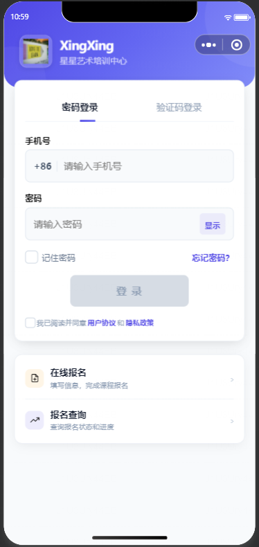
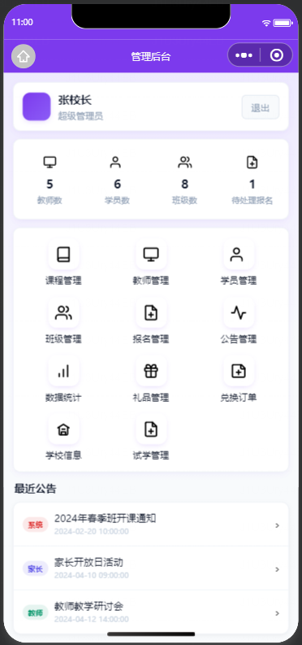
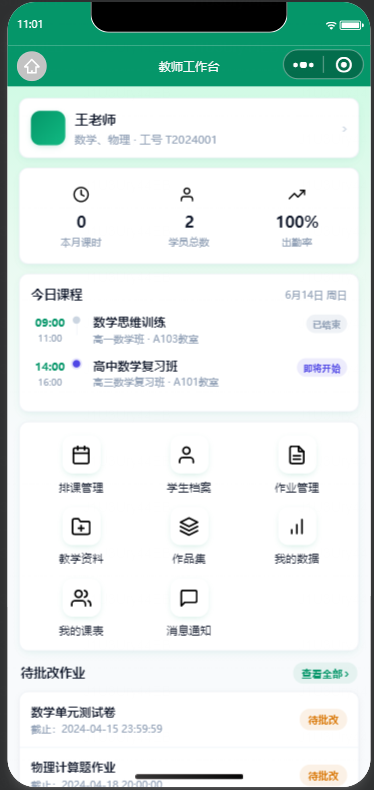
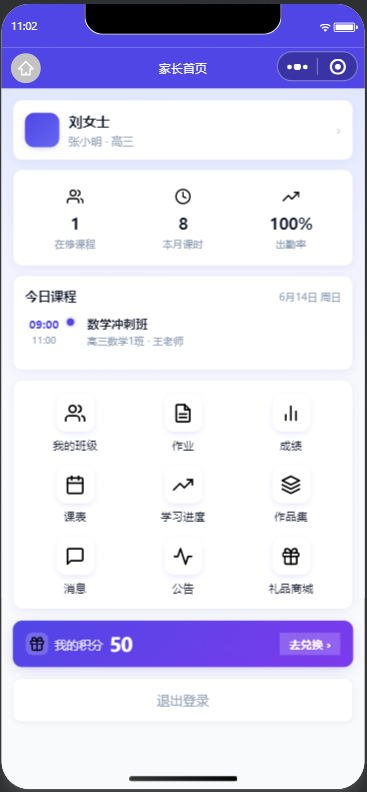
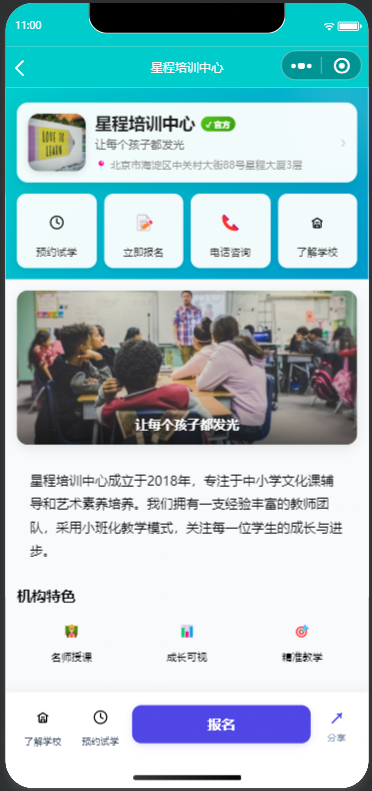

# EduTrain 星星艺术培训 - 微信小程序

面向线下培训机构的数字化管理平台，通过微信小程序连接机构、教师和家长，提升家长满意度和口碑传播，帮助机构获得更多生源。

## 角色与功能

项目支持四种角色，登录后自动跳转至对应首页：

### 管理员端
- 数据统计仪表盘（学员、教师、班级、收入）
- 教师管理（增删改查、详情查看）
- 学员管理（增删改查、状态变更、详情查看）
- 班级管理（创建、编辑、排课、学员名单）
- 课程管理（课程CRUD、状态上下架）
- 报名管理（报名审核、自动注册）
- 公告管理（发布、置顶、编辑、删除）
- 机构品牌配置
- 试听报告管理
- 积分商城管理（礼品、兑换订单）

### 教师端
- 工作台（今日课程、待批作业、消息通知）
- 班级与课程详情
- 排课与课表查看
- 作业发布与批改
- 学员考勤与成绩录入
- 教学资料管理（上传、分享到班级）
- 学生作品集管理（发布、精选、标记优秀）
- 消息中心
- 个人中心与数据统计

### 家长端
- 首页（孩子课程、作业、公告概览）
- 课表查看
- 课程列表与选课报名
- 作业查看与提交
- 学习进度与成绩查询
- 成长报告（自动生成、支持分享）
- 学生作品集查看
- 积分商城（积分兑换礼品）
- 推荐有礼（邀请码分享）
- 机构品牌主页
- 个人中心与设置

### 学生端
- 首页/工作台（今日课程、待完成作业）
- 课程列表与详情
- 作业列表与提交
- 学习资料查看
- 成绩查询
- 消息中心
- 个人中心

## 技术栈

**小程序端：** 微信小程序原生开发，Mock 数据 / 真实 API 双模式切换

**后端：** Python (FastAPI) + SQLAlchemy + Alembic，Docker 部署

## 项目结构

```
training-miniprogram/
├── app.js                          # 小程序入口，登录状态管理与角色路由
├── app.json                        # 全局页面注册与窗口配置
├── app.wxss                        # 全局样式
├── config.js                       # 环境配置（dev/test/prod）与 Mock 开关
├── pages/                          # 页面目录（78 个页面）
│   ├── login/                      # 登录（手机号/验证码/微信登录）
│   ├── admin-*/                    # 管理员端页面
│   ├── teacher-*/                  # 教师端页面
│   ├── parent-*/                   # 家长端页面
│   ├── index/                      # 学生端首页
│   ├── courses/                    # 课程列表
│   ├── homework/                   # 作业
│   ├── enrollment/                 # 报名
│   └── ...                         # 其他功能页面
├── utils/
│   ├── api.js                      # 请求封装（Mock 路由匹配 + 真实 API）
│   ├── storage.js                  # 本地存储封装
│   ├── format.js                   # 格式化工具
│   ├── markdown.js                 # Markdown 渲染
│   ├── fileUtil.js                 # 文件工具
│   └── share-points.js             # 积分分享
├── data/                           # Mock 数据与方法
├── images/                         # 图片资源
├── svg/                            # SVG 图标
├── backend/                        # 后端服务
│   ├── app/                        # FastAPI 应用
│   │   ├── routers/                # API 路由
│   │   ├── models/                 # 数据模型
│   │   ├── schemas/                # 请求/响应 Schema
│   │   ├── services/               # 业务逻辑
│   │   ├── repositories/           # 数据访问层
│   │   └── ...
│   ├── alembic/                    # 数据库迁移
│   ├── tests/                      # 测试
│   ├── docker-compose.yml
│   └── Dockerfile
└── docs/                           # 文档
    ├── product-requirements-document.md
    └── backend-technical-document.md
```

## 快速开始

### 小程序端

1. 使用微信开发者工具打开本项目
2. 修改 `project.config.json` 中的 `appid`
3. 默认使用 Mock 数据，可直接运行；切换真实 API 需修改 `config.js` 中 `useMock: false`

### 后端

```bash
cd backend
pip install -r requirements.txt
alembic upgrade head
uvicorn app.main:app --reload --port 8801
```

## 截图

| 登录 | 管理员端 | 教师端 | 家长端 |
|------|---------|--------|--------|
|  |  |  |  |

<details>
<summary>机构品牌主页</summary>



</details>
